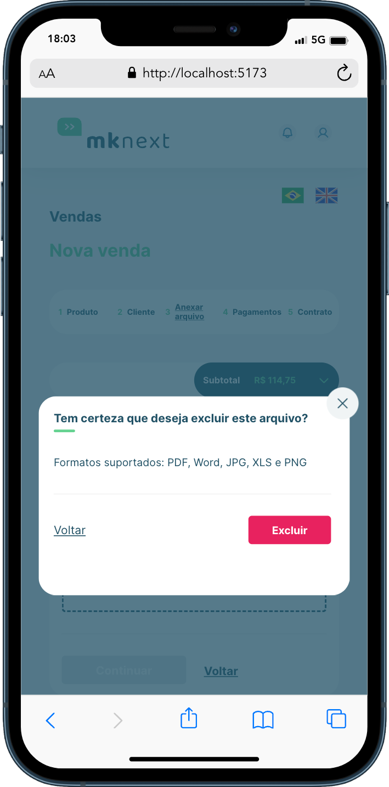

<div>
  <h1 style="text-align: center; font-weight: bold;">MK Next - Challenge</h1>
  
</div>

<br>
<br>

## Sobre o Projeto

Este é um projeto feito como desafio para a vaga de desenvolvedor front-end na empresa MK Solutions. A aplicação consiste em parte de um formulário de vendas. Nessa parte solicitada, é feito o cadastro de clientes, a atualização dos dados dos clientes cadastrados e o upload de arquivos.

### Tecnologias Usadas

- [React](https://reactnative.dev/)
- [Vite](https://expo.dev/)
- [TypeScript](https://www.typescriptlang.org/)
- [Styled Components](https://styled-components.com/)
- [Eslint](https://eslint.org/)
- [Json-server](https://github.com/typicode/json-server)
- [Axios](https://axios-http.com/ptbr/docs/intro)
- [React Router](https://reactrouter.com/en/main)
- [React Hook Form](https://react-hook-form.com/)
- [React I18Next](https://react.i18next.com/)
- [IBGE Api](https://servicodados.ibge.gov.br/api/docs)
- [Jest](https://jestjs.io/pt-BR/)

### Como rodar a aplicação

```bash
# Clone este repositório
$ git clone https://github.com/marrcelosantana/mk-challenge
# Acesse a pasta do projeto
$ cd mk-challenge
# Instale as dependências
$ npm install
# Execute a aplicação em modo de desenvolvimento
$ npm run dev

```

### Como rodar o fake backend da aplicação

```bash
# Clone este repositório
$ git clone https://github.com/marrcelosantana/mk-challenge
# Acesse a pasta do projeto
$ cd mk-challenge
# Instale as dependências
$ npm install
# Execute o backend da aplicação
$ npm run api

```

### Link de uma video explicação sobre o sistema

Link: https://youtu.be/jBtKJQ2YIu4

### Responsividade

|                  Cliente                   |                 Arquivos                 |                   Modal                   |
| :----------------------------------------: | :--------------------------------------: | :---------------------------------------: |
|  |  |  |
